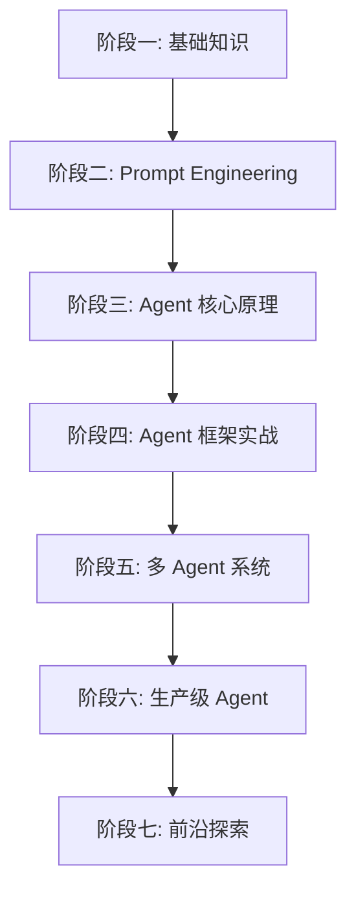

# AI Agent 学习路线图

> 从零基础到精通 AI Agent 开发的完整学习路径

## 📌 路线图概览

## 🗺️ 各阶段导航

| 阶段 | 核心主题 | 预计时间 | 笔记入口 |
|------|---------|---------|---------|
| 一 | LLM 基础 + Python 准备 | 1-2 周 | [[Agent路线图-01-基础知识]] |
| 二 | 提示工程 | 1-2 周 | [[Agent路线图-02-Prompt Engineering]] |
| 三 | Agent 核心原理 | 2-3 周 | [[Agent路线图-03-Agent核心原理]] |
| 四 | Agent 框架实战 | 2-3 周 | [[Agent路线图-04-框架实战]] |
| 五 | 多 Agent 系统 | 2-3 周 | [[Agent路线图-05-多Agent系统]] |
| 六 | 生产级 Agent 开发 | 2-4 周 | [[Agent路线图-06-生产级开发]] |
| 七 | 前沿探索 | 持续 | [[Agent路线图-07-前沿探索]] |

**总计约 3-4 个月，可根据自身基础灵活调整。**

## 🎯 学习建议

- 每个阶段都有**理论学习 + 动手实践**
- 优先完成阶段一到三（核心基础），再根据兴趣选择方向
- 遇到不懂的概念，在笔记中标记 `#待深入` 标签
- 建议边学边做项目，不要只看不动手
