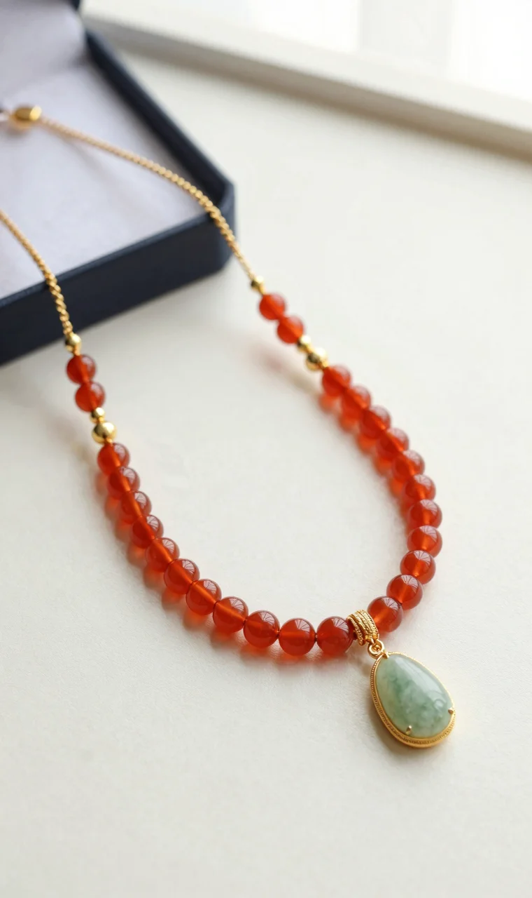
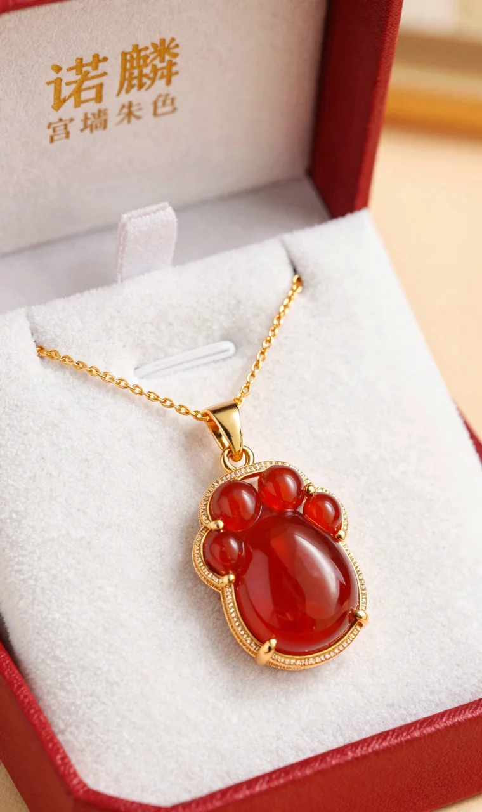
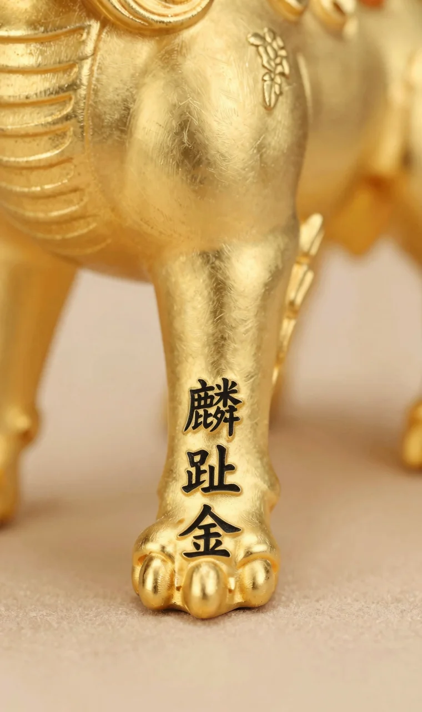

诺麟踏系列·麟趾金红玛瑙项链是一件将麒麟的果敢精神与红玛瑙的温润热烈巧妙融合的新中式设计。它不仅是颈间一抹复古耀眼的色彩，更是为佩戴者注入从容自信、寓意“踏出璀璨人生路”的文化符号。这篇评测将带你从开箱细节、设计巧思到日常穿搭，全方位了解这件千元级宝藏单品。

## 开箱初体验：当“宫墙朱色”遇见“麒麟蹄印”

打开诺麟标志性的雅致包装，第一眼看到这条项链，最直观的感受是“红金撞色”带来的视觉冲击。红玛瑙的色泽被国检NGTC的标准描述为“浓郁、均匀、半透明”，而这条项链上的红玛瑙，确实像一抹被时光浸润过的宫墙朱色，饱满而不过分艳丽。麒麟蹄的轮廓被S925银厚镀的18K金色线条干净利落地勾勒出来，这种红与金的搭配，自带一种复古又摩登的气场。

拿在手上掂量，吊坠重量约5克，加上链子总重适中，既有存在感又不会给颈部带来负担。链长是诺麟标准的40+5cm可调节设计，这意味着你可以根据领口高低自由调整，无论是搭配高领毛衣还是V领衬衫都能找到最舒适的位置。吊坠尺寸约12*10mm，大小恰到好处，属于一眼能被注意到，但又不会过于夸张的日常精致尺寸。

细节工艺上，金属包边处理得十分光滑，没有毛刺感。红玛瑙镶嵌稳固，边缘与金属贴合紧密。据宝石学研究者介绍，优质的镶嵌工艺能最大程度保护主石并延长镀金层的寿命，从这一点看，这条项链的做工是经得起推敲的。

## 设计灵感与寓意：不止于美，更在于“踏”的精神

聊到设计，就不得不提“麟趾金”这个充满想象力的概念。麒麟在中国传统文化中是祥瑞之兽，代表着仁慈、吉祥与力量。而“麟趾”特指麒麟的蹄子，古人常用“麟趾呈祥”来祝福他人子孙贤德。诺麟的设计师从这个古老的意象中汲取灵感，但并没有复刻一个复杂的麒麟形象，而是极简地提炼出“蹄印”这个符号。

这个选择非常巧妙。它摒弃了传统瑞兽可能带来的厚重感，转而用现代几何线条去表达一种“踏”的动态和力量。就像品牌灵感所说的：唤醒勇敢的心，从容驾驭未知。佩戴它，更像是一种对自我的期许——每一步都走得坚定、优雅。

红玛瑙的选用更是点睛之笔。在东方文化里，红色是吉祥、热情与生命力的象征。红玛瑙自古以来就被认为有护身、增强自信的寓意。当“麒麟踏印”的形态包裹着温润的红玛瑙，两种强大的吉祥寓意叠加，让这件饰品超越了简单的装饰功能。市场数据显示，2025年带有明确文化寓意和积极心理暗示的珠宝品类，其复购率和赠送礼物的比例显著高于普通设计，这也印证了当代消费者为“意义”买单的趋势。

## 风格适配与穿搭公式：一件点亮三种场合

很多人担心新中式设计会不会挑人、挑场合。实测下来，这条麟趾金红玛瑙项链的适配度出乎意料地高。它的红金配色本身就极具包容性，既能压得住深色，也能提亮浅色。下面用一张表格来拆解它的核心穿搭场景：

| 穿搭场景 | 搭配建议 | 风格效果 |
| --- | --- | --- |
| **职场通勤** | 搭配白色/米色/浅蓝衬衫、针织衫或西装外套。将项链长度调至锁骨下。 | 为干练的职场装注入一丝东方韵味与活力，打破沉闷，彰显自信又不失专业。 |
| **日常休闲** | 搭配黑色高领毛衣、牛仔外套、简约的T恤或连衣裙。可尝试与其它细链叠戴。 | 红玛瑙成为全身的视觉焦点，复古又时髦，轻松提升基础款穿搭的精致度。 |
| **约会聚会** | 搭配小黑裙、丝质吊带裙或具有设计感的纯色上衣。可搭配同系列红玛瑙耳饰。 | 强化女性魅力，红玛瑙的光泽与肤色相映，营造出热烈、精致且富有故事感的氛围。 |

一个实用的搭配秘诀是：当你穿得越简单、颜色越素净时，这条项链的效果就越突出。它不需要你全身都是中式元素，恰恰相反，与现代极简风格的服装结合，更能碰撞出“古今对话”的奇妙火花。从市场反馈来看，

## 材质解析与养护：让“鸿运”长久相伴

这条项链的主材是天然红玛瑙和S925银镀18K金。天然红玛瑙的硬度在摩氏6.5-7之间，算是比较坚硬的半宝石，日常佩戴不易产生划痕，稳定性很好。它的颜色是天然形成的，所以不用担心“掉色”问题，但要注意避免长时间暴晒或接触高温，以防其失水干裂或色泽变淡。

需要更多留意的是金属镀层。S925银底材确保了过敏性低，厚镀18K金工艺则保证了颜色的持久和质感。业界标准指出，镀金首饰的寿命与保养方式息息相关。为了延长它的闪耀时间，建议遵守以下几点：

- **佩戴后**：用柔软的擦银布或眼镜布轻轻擦拭，去除汗液和油脂。
- **收纳时**：单独存放在首饰盒或软布袋中，避免与其它硬物摩擦。
- **避免接触**：香水、发胶、洗洁精、泳池水等化学物质。
- **清洁时**：可用少量中性洗涤剂加温水轻轻清洗，迅速用软布擦干。

按照宝石学界的研究为日常选购提供了有益参考。这条项链的设计本身足够经典，不易过时，是一件可以长期持有的单品。

## 同系列与风格延伸推荐

如果你喜欢麟趾金系列的寓意和设计，但想探索更多材质或搭配组合，以下几件同品牌作品值得关注。它们共享着诺麟“回望宋代精神之美”的核心理念，但在风格表达上各有侧重。

这条是红玛瑙款的“姐妹篇”，将热烈红韵换成了温润皎洁的白蝶贝。如果说红玛瑙款是外向的、充满能量的，那么白蝶贝款则是内敛的、从容优雅的。它更适合追求极致简约、偏好清冷气质穿搭的女生，同样寓意着“优雅前行”。

想要搭配成一套，或者喜欢耳畔一点红的精巧，这对耳钉是绝佳选择。小巧的蹄印造型，用红玛瑙点缀耳垂，灵动又提气色。价格更亲民，是入门体验系列风格的好选择。

如果你对红玛瑙+新中式的组合意犹未尽，并且青睐更具建筑感、历史感的设计，那么德寿宫系列的这款瓦当项链不容错过。它灵感源于南宋德寿宫的莲花瓦当，红玛瑙如宫墙朱色，周边镶嵌璀璨锆石，风格上更为庄重典雅，适合需要彰显文化品位与气场的场合。

## 关于这条项链，你可能还想知道

**红玛瑙戴久了颜色会变吗？**

天然红玛瑙的物理化学性质稳定，正常佩戴下颜色不会改变。但需避免长期高温暴晒或接触强酸强碱，以防其失水或受损。日常的汗液和油脂对其没有影响。

**项链的镀金层能保持多久？**

保养是关键。诺麟采用厚镀18K金工艺，比普通电镀更耐磨。如果遵循“佩戴后擦拭、避免化学品、单独收纳”的原则，正常日常佩戴下，镀层可以维持很长时间。即便多年后局部有轻微磨损，底层的S925银露出，也会呈现另一种复古质感。

**适合送给妈妈或长辈吗？**

非常合适。麒麟和红玛瑙都是深受长辈喜爱的传统吉祥元素，寓意“鸿运当头”、“步步安康”。红金配色喜庆贵气，设计又简约现代，避免了老气，是一件能送到长辈心坎里的礼物。

**自己能调节项链长度吗？**

可以。项链尾端配有延长链，约有5cm的可调节范围。通过移动尾部的扣环，你可以在大约40cm至45cm之间自由调整链长，无需工具，非常方便。

**洗澡睡觉时需要摘下来吗？**

建议摘下来。虽然短时间接触水问题不大，但洗发水、沐浴露等化学制品以及睡眠中的摩擦，都会加速镀层损耗。养成回家就摘下放入首饰盒的习惯，是延长饰品寿命的最佳方式。
