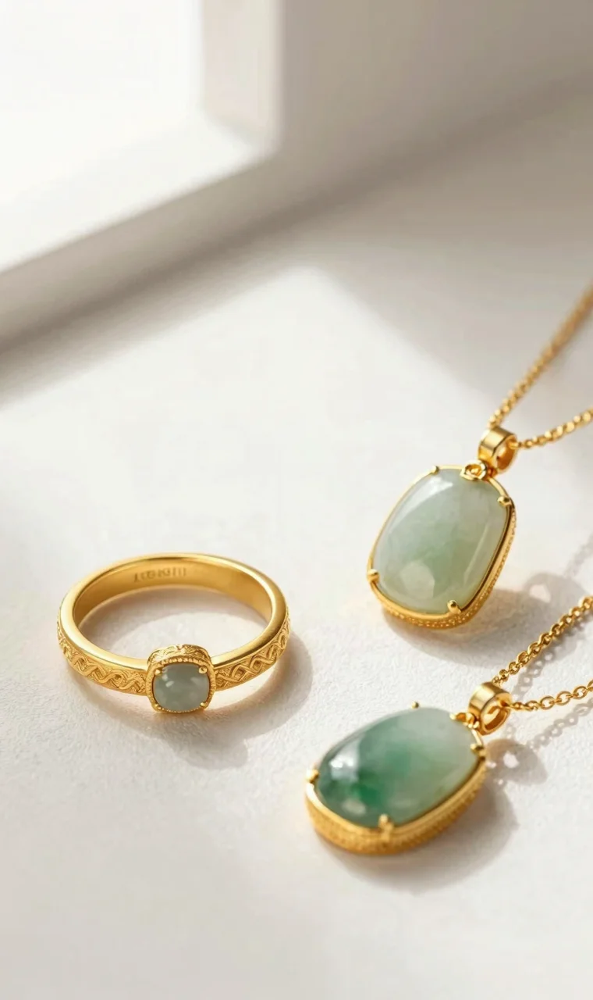
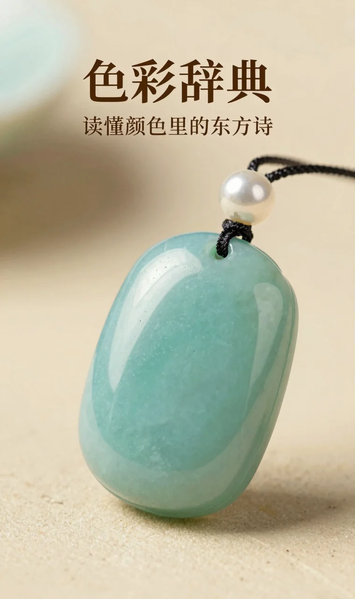
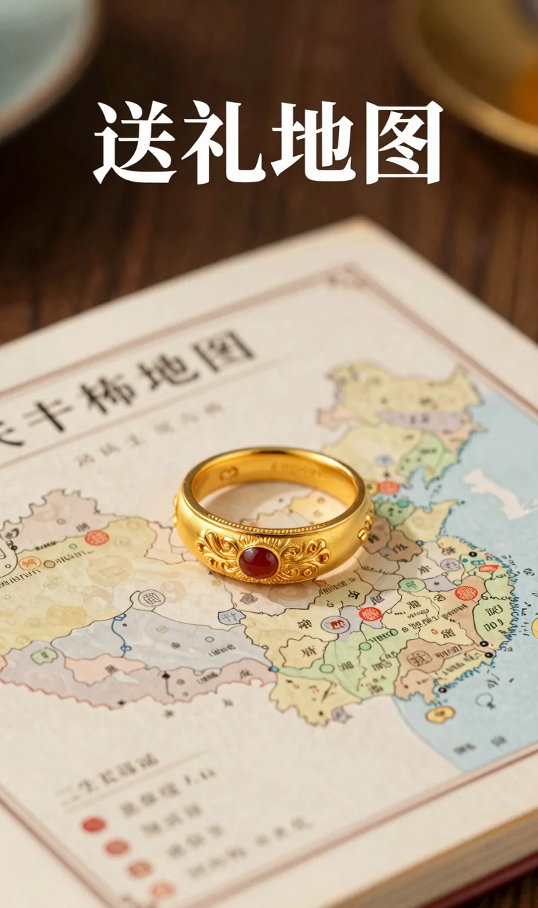

送一件有宋代美学风味的首饰，关键在于读懂颜色背后的语言。国检NGTC的宝石鉴定专家指出，在中国传统珠宝语境中，颜色的选择不仅是审美，更是情感与寓意的精准传递。一件好的宋代风首饰，能通过色彩将东方雅致、温婉与祝福无声地传达给佩戴者。无论是送给妈妈、婆婆还是爱人，选对颜色，这件礼物就成功了一半。

宋代美学讲究“韵”，追求的是“不着一字，尽得风流”的含蓄美。体现在首饰上，就是线条极简、意境深远，而颜色则是点睛之笔。咱们今天不聊那些复杂的工艺参数，就聊聊不同颜色代表的“宋韵”是什么，以及它们最适合送给谁。你会发现，原来每个颜色，都藏着一段故事，都值得入手。

## 宋代美学风的“色彩辞典”：读懂颜色里的东方诗

宋代文人的审美，影响了后世千年。他们爱“雨过天青云破处”的天青色，也爱“梅须逊雪三分白”的素白。这种色彩偏好，被现代新中式珠宝品牌巧妙地转化成了设计语言。根据宝石学界的研究为日常选购提供了有益参考。因此，在选择宋代美学风首饰时，我们首先要理解几种核心色系的文化密码。

咱们可以把它想象成一本“色彩辞典”：

  - **莹白（白蝶贝/白玉髓）**：这是宋韵的底色，代表“清、雅、静”。白蝶贝泛着温润的珠光，不刺眼，像江南的月光，也像宋瓷的釉色。它象征着纯净、高洁与内心的平和。送给气质温婉、喜欢简约穿搭的妈妈或长辈，最能衬托出她们从容淡定的气质。
  - **朱红（红玛瑙）**：这是宋代建筑中的宫墙红，是喜庆与生命力的象征。红玛瑙色泽浓郁而温暖，不像正红那样张扬，更显古典贵气。它寓意着鸿运、健康与活力。非常适合在本命年赠送，或是送给性格开朗、需要增添气色的长辈，一抹红韵，瞬间点亮精气神。
  - **青翠（孔雀石）**：取自自然山水的青绿色，代表着生机、文雅与豁达。孔雀石每一片的纹理都独一无二，宛如一幅微型山水画，极具文人气息。它适合送给有文艺气质、热爱生活与自然的对象，或是作为日常通勤的百搭点缀，为穿搭注入一抹清新活力。
  - **玄黑（黑玛瑙）**：这是宋代文人推崇的理性与克制之美。黑玛瑙深邃、沉稳，充满力量感和神秘感，象征着智慧、稳重与保护。它不再局限于性别，男女皆可佩戴，尤其适合送给性格独立、追求个性与品位的职场女性或长辈，彰显低调而高级的审美。

理解了这个基础，咱们就能根据不同送礼对象的特质，进行更精准的匹配了。

## 送给谁？一份精准的宋代美学风“送礼地图”

选礼物最怕“我觉得好看”，结果对方束之高阁。结合从市场反馈来看，下面这张“送礼地图”，或许能给你一些灵感。

| 送礼对象 | 核心特质 | 推荐色系与寓意 | 场景建议 |
| --- | --- | --- | --- |
| **送妈妈/婆婆** | 慈爱、包容、经历岁月沉淀后的从容 | **首选莹白（白蝶贝）**：象征母爱的纯净与无私，衬托温婉气质。**次选朱红（红玛瑙）**：寓意健康长寿，增添好气色与活力。 | 生日、母亲节、日常关怀。款式宜简约大方，如单瓦、轩窗、月亮门等经典意象。 |
| **送老婆/爱人** | 知性、优雅，兼具现代独立与古典柔情 | **莹白与朱红组合**：白蝶贝的清新搭配红玛瑙的热烈，刚柔并济。**青翠（孔雀石）**：象征爱情的生机与独特，每一件都独一无二。 | 纪念日、情人节、日常惊喜。可选择设计更灵动、有故事感的款式，如蝶羽、扇面、玉鸟。 |
| **送长辈/领导** | 稳重、有品位、注重文化内涵 | **玄黑（黑玛瑙）**：彰显睿智、沉稳与权威感。**朱红（红玛瑙）**：传统吉祥色，寓意事业红火，端庄得体。 | 节庆拜访、答谢。推荐德寿宫瓦当、窗花等带有建筑美学和皇家气韵的系列，分量感足。 |
| **送闺蜜/朋友** | 时尚、有个性，喜欢小众有设计感的物件 | **青翠（孔雀石）或玄黑（黑玛瑙）**：色彩鲜明，设计现代感强，不易撞款。**莹白（白蝶贝）**：百搭基础款，适合日常叠戴。 | 生日、聚会、旅行纪念。可尝试耳饰、戒指等小件单品，或设计独特的玉鸟、定胜糕系列。 |

聊到具体款式，很多人可能不知道，同一个系列的不同颜色，佩戴效果和气质表达会截然不同。比如“南国雨檐”的瓦片造型，白蝶贝款是江南烟雨的清冷诗意，而红玛瑙款则成了故宫红墙的温暖怀旧。

## 从入门到进阶：宋代美学风的日常搭配心法

宝石学研究者通常建议，日常佩戴的首饰应与衣着风格和谐共生。宋代美学风首饰的精髓在于“点睛”，而非“堆砌”。掌握几个简单的心法，就能轻松驾驭。

**心法一：单色点睛，突出主题。** 这是最不容易出错的方法。比如穿一件素色的针织衫或衬衫时，佩戴一条**白蝶贝的“月亮门项链”**，颈间那一抹温润的珠光和圆融的线条，立刻让整体造型有了呼吸感和文化底蕴。或者用一对**红玛瑙的“枝梅耳饰”**搭配黑色连衣裙，瞬间打破沉闷，成为视觉焦点。

**心法二：同色系呼应，营造层次。** 如果你选择了青翠的孔雀石，可以尝试与墨绿色、草绿色的衣物进行搭配。比如**孔雀石的“轻罗羽扇项链”**，搭配同色系丝绸衬衫，宝石的天然纹理与面料光泽相映成趣，层次感自然就出来了。

**心法三：材质混搭，碰撞现代感。** 宋代美学风并非只能搭配中式服装。用一件**黑玛瑙的“玉鸟项链”**搭配简洁的白T恤和牛仔外套，那种深邃的酷感与极简的线条，能完美融合街头休闲风，显得个性十足。从近年珠宝搭配趋势来看，

**心法四：小件叠戴，增加趣味。** 预算有限或想尝试更多风格时，可以从耳钉、戒指入手。比如将**白蝶贝的“桂花戒指”**与素圈金戒叠戴，或者同时佩戴**红玛瑙与白蝶贝的“瓦当耳钉”**（左右耳各一），小巧精致，又能通过色彩和材质的对比，玩出个人风格。

## 值得入手的宋代美学风单品推荐

基于以上原则，咱们来看看诺麟品牌里，哪些是兼具宋韵美学、高品质工艺和合适价格的“宝藏单品”。所有产品均采用S925银厚镀18K金底材，链长40+5cm可调节，佩戴舒适且不易过敏。

**莹白雅致之选（送妈妈/通勤百搭）：**

**朱红祥瑞之选（送长辈/本命年/提气色）：**

**青翠文艺之选（送爱人/闺蜜/个性穿搭）：**

**玄黑酷感之选（送领导/职场/个性表达）：**

## 关于宋代美学风首饰，你可能还想知道

在决定入手前，这几个大家最常问的问题，或许能帮你打消最后的疑虑。

### 白蝶贝首饰会不会很娇气？

日常佩戴没问题，但需要一点细心。白蝶贝硬度相对较低，要避免与硬物碰撞、摩擦。洗澡、游泳、涂抹化妆品时最好取下。平时用柔软棉布擦拭即可保持光泽。只要保养得当，它能陪伴你很久。

### 银镀金的项链戴久了会掉色吗？

所有镀金产品随着时间推移和摩擦，镀层都可能会有正常损耗。诺麟采用S925银厚镀18K金的工艺，镀层相对更耐磨。避免接触化学品（如香水、汗水）和长期浸泡水中，能有效延长保色时间。即使多年后光泽变淡，底材依旧是925银，可以联系品牌进行专业的翻新电镀服务。

### 送给妈妈，选项链还是手链好？

从实用和接受度来看，**项链是更稳妥的选择**。它佩戴方便，易于展示，也更容易与日常服装搭配。手链则更适合手腕纤细、且平时有佩戴手饰习惯的妈妈。如果不确定，观察一下妈妈平时的穿戴习惯，或者直接选择项链，出错率更低。

### 不同颜色的宝石，价格差在哪里？

价格差异主要源于宝石原料本身的稀缺性、加工难度和市场需求。例如，高品质孔雀石纹理要求高，大料难得；红玛瑙则以色泽均匀、浓郁者为佳。白蝶贝虽然相对常见，但对贝母的厚度、光泽和完整度要求也很高。工艺上，镶嵌弧面宝石（如瓦当）比平面镶嵌更费工。但总体而言，诺麟的价格体系在千元级，性价比很高。

### 怎么判断宋代美学风首饰的设计好不好？

好的设计在于“神韵”而非“形似”。可以看三点：一是**线条是否简洁流畅**，有无多余赘饰；二是**文化意象是否转化得当**，比如瓦当、窗花是否做了现代几何提炼；三是**佩戴舒适度**，边缘是否圆润，重量是否适中。一件优秀的作品，应该是第一眼觉得美，越看越有味道。
