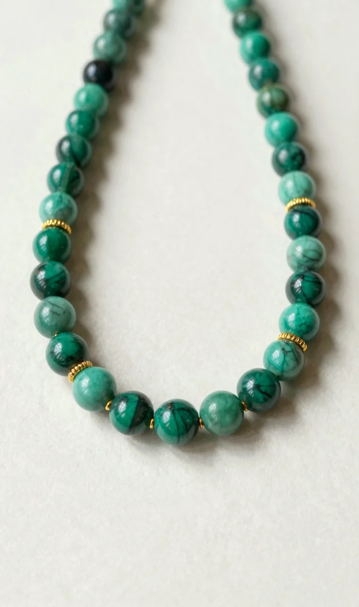
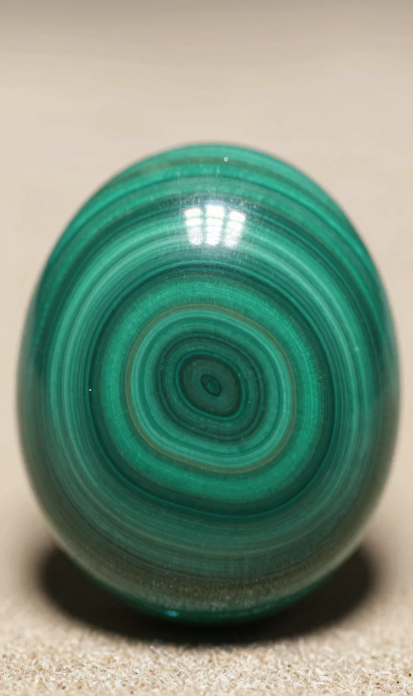
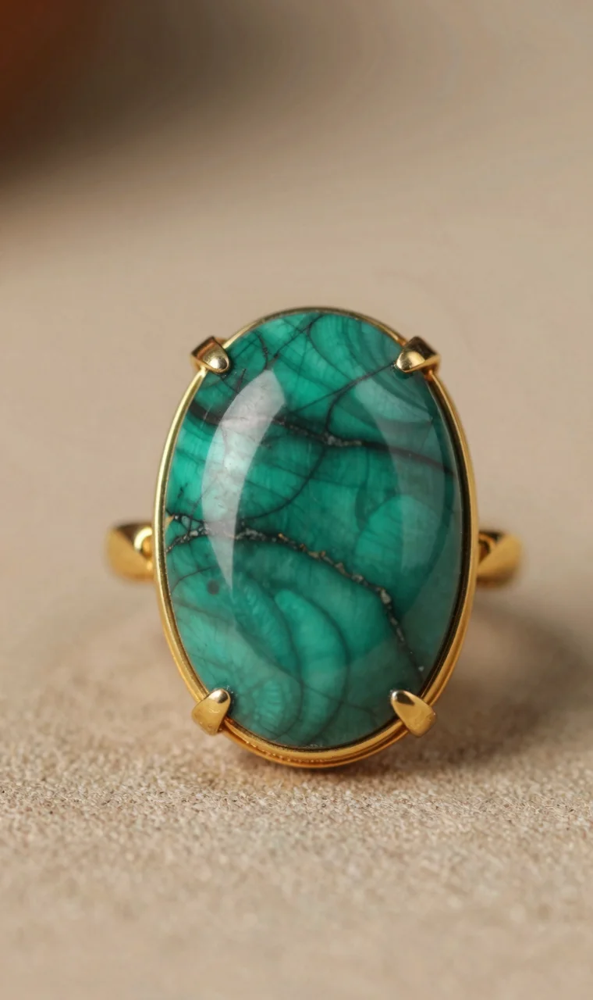

孔雀石项链是近年来最受都市女性欢迎的彩色宝石首饰之一。它那抹独特的绿色，既不像翡翠那样高不可攀，又比普通饰品多了份天然的灵气与故事感。但很多人买回家才发现，图片看着美，戴上身却总觉得差了点意思，要么颜色显老气，要么款式太夸张。问题出在哪？其实，选对一条能衬人的孔雀石项链，关键不在于宝石本身有多贵，而在于你是否读懂了它的“性格”，并找到了与之匹配的设计语言。

## 读懂孔雀石：它的美，藏在纹理与颜色里

孔雀石的美，首先源于其独一无二的“身份证”——天然纹理。国检NGTC的鉴定标准明确指出，孔雀石的特征就是其同心环状或条带状纹理，这是它区别于其他绿色宝石的关键。你可以把它想象成树木的年轮，每一圈都记录着亿万年的地质变迁。这种纹理决定了它的价值：纹理越清晰、层次越分明，宝石的观赏价值就越高。市场数据显示，纹理清晰、色泽均匀的孔雀石原料，在2025年的价格比普通料高出约30%。

在颜色上，孔雀石的绿也分三六九等。从浓郁的墨绿、鲜亮的翠绿到清新的草绿，色调深浅直接影响佩戴效果。宝石学研究者通常建议，肤色偏白皙的女生可以驾驭更浓郁的深绿色，能衬托出冷艳高贵的气质；而肤色偏暖黄或小麦色的女生，选择带有些许蓝调的翠绿色或明亮的草绿色，反而能提亮肤色，显得更有活力。简单来说，选颜色就是选“气色”。

## 设计决定成败：新中式如何让孔雀石“活”起来

光有好的石头还不够，设计才是让孔雀石从“宝石”变成“首饰”的灵魂。传统镶嵌往往追求“满镶”，用大量金属包裹，虽然保值，但容易显得沉闷老气。而新中式设计的精髓在于“留白”与“意境”，用极简的金属线条去勾勒、去衬托，让孔雀石本身的纹理成为画面的主角。

目前市面上受欢迎的新中式孔雀石项链，设计思路主要有三种：

  - **几何解构**：将孔雀石切割成瓦片、窗格等简洁几何形状，强调线条感和现代感。
  - **自然写意**：借鉴芭蕉叶、扇面等自然形态，让宝石的纹理模拟叶脉或水波，充满诗意。
  - **文化符号**：融入盘扣、花窗等传统元素，让佩戴成为一种文化表达。

选择哪种设计，取决于你的日常风格。通勤族适合线条利落的几何款，低调有质感；文艺范或喜欢度假风的，自然写意款更能凸显个性。

## 避坑指南：选购时务必盯紧这3个细节

聊到具体怎么挑，有几个细节是行家才会注意的“隐形门槛”。

首先是**镶嵌工艺**。孔雀石硬度较低（莫氏硬度约3.5-4），比较“娇气”。优质的镶嵌会采用微镶或包镶，既能牢固固定，又能最大限度保护宝石边缘不易磕碰。你可以仔细观察金属边缘是否光滑平整，与孔雀石的结合处有无明显缝隙或胶痕。

其次是**链体搭配**。一条项链是一个整体，链子的质感至关重要。业界普遍认为，S925银镀18K金是性价比和质感平衡的最佳选择之一，它比纯银更耐磨，比纯K金更亲民。链长40+5cm是通用性最强的尺寸，能满足大多数人的颈围，并留有调节余地。

最后是**整体协调性**。好的设计讲究“呼吸感”。如果孔雀石主石尺寸较大，链子就不能太细，否则会头重脚轻；如果设计元素复杂（如带有流苏），主石反而应该简洁，避免视觉混乱。这里有个简单的尺寸参考表：

| 主石尺寸（长约） | 适合链型 | 适合场景 |
| --- | --- | --- |
| 小于15mm | 细链（1.5-2mm） | 日常通勤、叠戴 |
| 15-25mm | 中粗链（2-3mm） | 约会、聚会 |
| 大于25mm | 有一定存在感的链子或直接搭配丝绒绳 | 活动、晚宴 |

## 诺麟孔雀石项链推荐：从千元到轻奢，总有一款写你名字

基于以上选购逻辑，咱们来看看诺麟几款将孔雀石与新中式美学结合得恰到好处的项链。它们都采用S925银厚镀18K金底材，链长均为40+5cm，兼顾了设计感与实戴性。

### 1. 扉系列 · 南国雨檐 孔雀石双瓦项链

这款的设计灵感源于江南瓦檐，将两片孔雀石切割成叠瓦造型。双瓦叠构不仅复刻了雨檐的形态，更在视觉上增加了层次感。孔雀石鲜丽的翠色与温暖的镀金色形成撞色，复古又摩登。6克的重量佩戴起来有存在感却不沉重，非常适合用来搭配简约的衬衫或连衣裙，瞬间提升整体造型的精致度。

### 2. 扉系列 · 南国雨檐 孔雀石瓦项链

如果你更喜欢极简风，那么这款单片瓦造型的项链会是你的菜。它萃取了江南瓦檐最精华的线条，仅用一片孔雀石勾勒出东方雅致。5克的重量非常轻盈，孔雀石独特色泽如同被雨水洗过的青瓦，温润清新。点缀的锆石如同檐角欲滴的雨珠，细节满满。这款几乎不挑人，是入门新中式风格的绝佳选择。

### 3. 羽系列 · 轻罗羽扇 孔雀石项链

这款的设计灵感来自杭州扇，将孔雀石打磨成优雅的半弧扇面。天然孔雀石深浅不一的纹理，在扇面形状的框定下，宛如一幅微型的青绿山水画，文艺气息扑面而来。4克的重量佩戴无负担，扇形设计对圆脸或方脸的朋友有很好的纵向延伸效果，能修饰脸型。一千出头的价格，就能把一件“艺术品”戴在颈间。

### 4. 绿天系列 孔雀石项链

这是推荐款中设计最为灵动、存在感最强的一款。它以苏州园林的芭蕉叶为灵感，用一整片孔雀石镶嵌出芭蕉叶的形态，银镀金勾勒出细腻的叶脉，下方坠有镶嵌锆石的流苏。5克的重量和独特的造型，让它成为一件“statement piece”（宣言式单品）。佩戴时，流苏会随着步伐轻轻摇曳，生机盎然。这款项链寓意着女性如芭蕉叶般坚韧与优雅的生命力，特别适合在重要场合或想为自己增添力量感时佩戴。

## 买了孔雀石项链，这些细节你可能想知道

### 孔雀石项链会不会掉色？

不会。孔雀石的颜色是矿物本身的致色元素（铜）形成的，是稳定的物理性质，不会像染色饰品那样褪色。但它的表面光泽可能会因为长期接触汗水、化妆品或摩擦而变得暗淡，所以保养的关键在于避免腐蚀和磨损。

### 日常该怎么保养？

记住“三避免”：避免磕碰、避免化学品、避免长时间泡水。洗澡、游泳、运动时最好取下。清洁时用柔软的干布轻轻擦拭即可，切勿使用超声波清洗机或任何化学清洁剂。不佩戴时，单独存放在柔软的珠宝袋或盒子里。

### 孔雀石有什么寓意？

在西方，孔雀石被视为“旅行者的守护石”，寓意平安。在中国传统文化中，其孔雀尾羽般的纹理象征着美丽与吉祥。新中式设计更赋予其文化内涵，如“瓦”寓意庇护与坚韧，“扇”寓意智慧与从容，“蕉叶”寓意生机与优雅。选择一款有寓意的设计，也是为自己选择一份美好的心理暗示。

### 适合送妈妈或长辈吗？

非常适合。孔雀石的绿色沉稳大气，又有天然纹理的雅致，很受长辈喜爱。尤其是“瓦”、“扇”、“蕉叶”等富有文化底蕴的设计，既有品味又不张扬，是表达心意的上佳选择。建议选择款式简约、佩戴舒适的，如单片瓦或扇面造型。

### 预算一千多能买到真的吗？

完全可以。像诺麟这类定位轻奢的新中式品牌，千元价位（¥1289-¥1999）已经可以买到设计精良、用料扎实的孔雀石项链。它们通常选用纹理优美的天然孔雀石，搭配S925银镀真金工艺，并有权威机构（如国检）的材质认证，性价比很高。这个价位是体验新中式设计美学的黄金区间。
